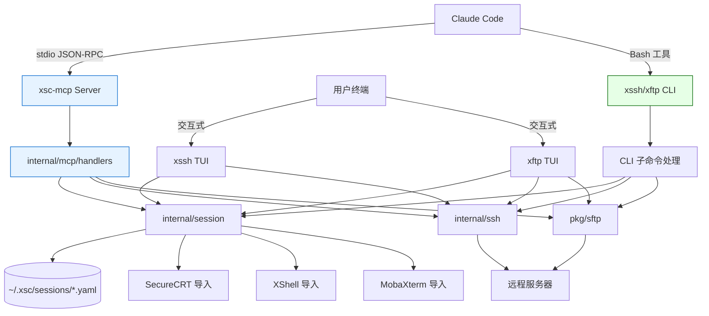
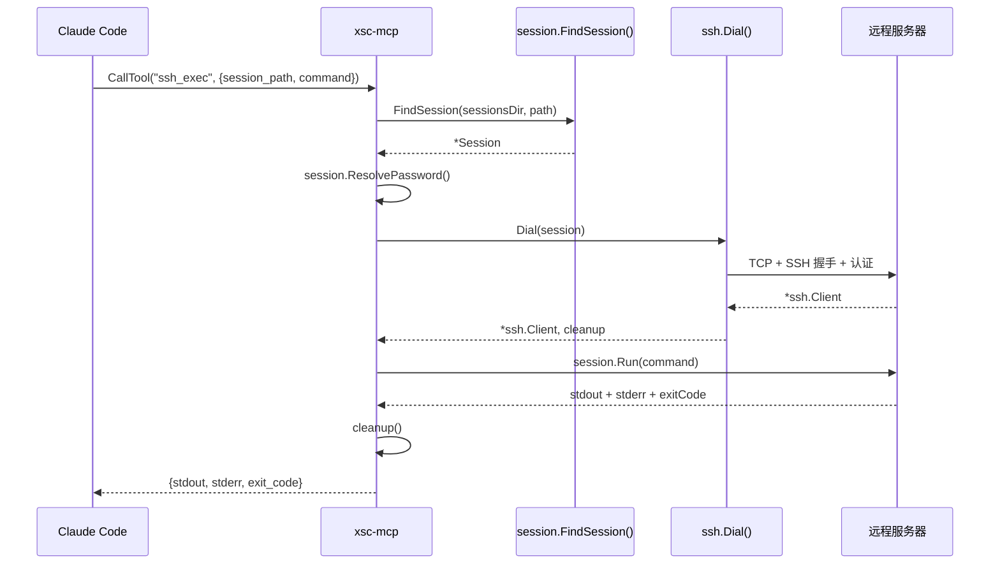

# RFC-2026-001: xsc MCP Server — 让 Claude Code 通过 xsc 管理远程服务器

| 属性 | 值 |
|------|---|
| 状态 | Draft |
| 作者 | ketor |
| 创建日期 | 2026-03-22 |
| 类型 | Feature |
| 输出语言 | zh |

## 1. 摘要

为 xsc 项目新增 MCP (Model Context Protocol) Server 模式，通过独立的 `xsc-mcp` 二进制程序，将 xsc 的 SSH 会话管理、远程命令执行、SFTP 文件操作能力以 MCP 工具的形式暴露给 Claude Code。同时在现有 `xssh` 和 `xftp` 命令上添加关键的非交互式 CLI 子命令，作为补充和调试手段。整个方案复用现有的 `internal/session`、`internal/ssh`、`internal/xftp` 包，无需修改会话格式或认证逻辑，Claude Code 注册后即可像用户一样访问所有已配置的服务器节点进行故障定位和运维操作。

## 2. 背景与动机

### 2.1 现状

xsc 项目提供两个 TUI 工具：
- **xssh**：基于 Bubble Tea 的 SSH 会话管理器，支持树形浏览、搜索、连接
- **xftp**：基于 Bubble Tea 的双面板 SFTP 文件管理器，支持浏览、上传、下载

两个工具都是交互式 TUI 程序，依赖终端键盘输入和屏幕渲染。xssh 已有 `list` 和 `connect` CLI 命令，但 `connect` 是交互式的（进入 shell）。

### 2.2 痛点

Claude Code 作为 AI 编程助手，通过 Bash 工具和 MCP 工具与系统交互。它**无法操作 TUI 界面**——不能按键导航、不能滚动、不能在交互式 shell 中输入命令。这意味着：

1. Claude Code 无法使用 `xssh connect` 连接服务器执行命令
2. Claude Code 无法使用 `xftp` 的 TUI 浏览远程文件系统
3. 用户在故障定位时需要在 Claude Code 和 xsc 之间频繁切换，效率低下

### 2.3 业务驱动力

让 Claude Code 具备远程服务器运维能力，可以：
- 直接在对话中检查服务器状态、查看日志、执行诊断命令
- 通过 SFTP 检查/修改远程配置文件
- 实现端到端的故障定位闭环，无需用户切换工具
- 复用 xsc 已有的会话配置和认证信息，零额外配置

## 3. 目标与非目标

### 3.1 目标

- **G1**: Claude Code 能列出和搜索 xsc 中已配置的所有 SSH 会话（含 SecureCRT/XShell/MobaXterm 导入的）
- **G2**: Claude Code 能通过会话路径连接到指定服务器并执行命令，获取 stdout/stderr 输出
- **G3**: Claude Code 能通过 SFTP 浏览远程目录、读取文件内容、上传/下载文件、创建目录、删除文件
- **G4**: 复用现有会话配置（密码、密钥、SSH Agent），无需额外配置认证信息
- **G5**: Claude Code 通过 `claude mcp add` 一行命令即可注册 xsc MCP Server
- **G6**: 提供 CLI 子命令作为非 MCP 场景的补充

### 3.2 非目标（明确不做的事）

- **NG1**: 不做交互式 shell 会话（不支持长时间保持连接的交互式终端）
- **NG2**: 不做端口转发/隧道功能
- **NG3**: 不做多跳/跳板机（ProxyJump）支持（后续可扩展）
- **NG4**: 不修改现有 TUI 功能或会话 YAML 格式
- **NG5**: 不做 MCP SSE/WebSocket 传输（仅 stdio）
- **NG6**: 不做连接池或持久连接管理（每次操作建立新连接，简单可靠）

## 4. 技术方案

### 4.1 总体架构

采用**混合架构**：MCP Server 为主 + CLI 子命令为辅。

**新增组件：**

| 组件 | 路径 | 职责 |
|------|------|------|
| `xsc-mcp` | `cmd/xsc-mcp/main.go` | MCP Server 入口，注册工具，启动 stdio 传输 |
| `mcp/` | `internal/mcp/` | MCP 工具处理器：会话管理、命令执行、SFTP 操作 |
| `sshexec` | `internal/ssh/exec.go` | 非交互式远程命令执行（`ssh.Session.CombinedOutput()`） |
| CLI 子命令 | `cmd/xssh/main.go`、`cmd/xftp/main.go` | 新增 `exec`、`ls`、`get`、`put` 等子命令 |

**不修改的组件：**

| 组件 | 说明 |
|------|------|
| `internal/session/` | 会话加载、查找、树结构 — 直接复用 |
| `internal/ssh/client.go` | `Dial()` — 直接复用建立 SSH 连接 |
| `internal/xftp/filesystem.go` | `RemoteFS` — 直接复用 SFTP 操作 |
| `pkg/config/` | 全局配置 — 直接复用 |
| `internal/tui/` | xssh TUI — 不修改 |
| `internal/xftp/model.go` | xftp TUI — 不修改 |

### 4.2 MCP 工具定义

MCP Server 暴露以下 7 个工具：

#### 4.2.1 会话管理

**`list_sessions`** — 列出所有可用的 SSH 会话

```json
{
  "name": "list_sessions",
  "description": "列出所有已配置的 SSH 会话。返回会话树结构，包含路径、主机、端口、用户、认证类型等信息。可通过 filter 参数过滤。",
  "inputSchema": {
    "type": "object",
    "properties": {
      "filter": {
        "type": "string",
        "description": "可选的过滤关键词，匹配会话路径或主机名"
      }
    }
  }
}
```

**`get_session`** — 获取指定会话的详细信息

```json
{
  "name": "get_session",
  "description": "获取指定 SSH 会话的详细配置信息（不含密码）。",
  "inputSchema": {
    "type": "object",
    "properties": {
      "session_path": {
        "type": "string",
        "description": "会话路径，如 'prod/web/server-01'。支持模糊匹配。"
      }
    },
    "required": ["session_path"]
  }
}
```

#### 4.2.2 远程命令执行

**`ssh_exec`** — 在远程服务器上执行命令

```json
{
  "name": "ssh_exec",
  "description": "通过 SSH 在远程服务器上执行命令并返回输出。适用于故障定位、状态检查、日志查看等运维操作。",
  "inputSchema": {
    "type": "object",
    "properties": {
      "session_path": {
        "type": "string",
        "description": "会话路径，如 'prod/web/server-01'"
      },
      "command": {
        "type": "string",
        "description": "要执行的 shell 命令"
      },
      "timeout": {
        "type": "integer",
        "description": "命令超时时间（秒），默认 30，最大 300",
        "default": 30
      }
    },
    "required": ["session_path", "command"]
  }
}
```

#### 4.2.3 SFTP 文件操作

**`sftp_list`** — 列出远程目录内容

```json
{
  "name": "sftp_list",
  "description": "列出远程服务器上指定目录的文件和子目录，包含大小、权限、修改时间。",
  "inputSchema": {
    "type": "object",
    "properties": {
      "session_path": { "type": "string", "description": "会话路径" },
      "remote_path": { "type": "string", "description": "远程目录路径，默认 home 目录", "default": "." }
    },
    "required": ["session_path"]
  }
}
```

**`sftp_read`** — 读取远程文件内容

```json
{
  "name": "sftp_read",
  "description": "读取远程服务器上的文件内容。适用于查看配置文件、日志片段等。大文件会截断到 maxSize。",
  "inputSchema": {
    "type": "object",
    "properties": {
      "session_path": { "type": "string", "description": "会话路径" },
      "remote_path": { "type": "string", "description": "远程文件路径" },
      "max_size": { "type": "integer", "description": "最大读取字节数，默认 1MB", "default": 1048576 },
      "offset": { "type": "integer", "description": "读取起始偏移量（字节），用于大文件分段读取", "default": 0 }
    },
    "required": ["session_path", "remote_path"]
  }
}
```

**`sftp_write`** — 写入远程文件

```json
{
  "name": "sftp_write",
  "description": "将内容写入远程服务器上的文件。可用于修改配置文件。会覆盖已有文件。",
  "inputSchema": {
    "type": "object",
    "properties": {
      "session_path": { "type": "string", "description": "会话路径" },
      "remote_path": { "type": "string", "description": "远程文件路径" },
      "content": { "type": "string", "description": "要写入的文件内容" },
      "mode": { "type": "string", "description": "文件权限，如 '0644'", "default": "0644" }
    },
    "required": ["session_path", "remote_path", "content"]
  }
}
```

**`sftp_upload`** — 上传本地文件到远程服务器

```json
{
  "name": "sftp_upload",
  "description": "将本地文件上传到远程服务器。",
  "inputSchema": {
    "type": "object",
    "properties": {
      "session_path": { "type": "string", "description": "会话路径" },
      "local_path": { "type": "string", "description": "本地文件路径" },
      "remote_path": { "type": "string", "description": "远程目标路径" }
    },
    "required": ["session_path", "local_path", "remote_path"]
  }
}
```

**`sftp_download`** — 从远程服务器下载文件

```json
{
  "name": "sftp_download",
  "description": "从远程服务器下载文件到本地。",
  "inputSchema": {
    "type": "object",
    "properties": {
      "session_path": { "type": "string", "description": "会话路径" },
      "remote_path": { "type": "string", "description": "远程文件路径" },
      "local_path": { "type": "string", "description": "本地目标路径" }
    },
    "required": ["session_path", "remote_path", "local_path"]
  }
}
```

### 4.3 详细设计

#### 4.3.1 `cmd/xsc-mcp/main.go` — MCP Server 入口

```go
package main

import (
    "context"
    "log"
    "os"

    "github.com/ketor/xsc/internal/mcp"
    mcpsdk "github.com/modelcontextprotocol/go-sdk/mcp"
)

func main() {
    // 抑制 stdout 日志输出（MCP stdio 要求）
    log.SetOutput(os.Stderr)

    server := mcpsdk.NewServer(&mcpsdk.Implementation{
        Name:    "xsc-mcp",
        Version: version.Version,
    }, nil)

    // 注册所有工具
    mcp.RegisterTools(server)

    // 通过 stdio 传输运行
    if err := server.Run(context.Background(), &mcpsdk.StdioTransport{}); err != nil {
        log.Fatalf("MCP server error: %v", err)
    }
}
```

#### 4.3.2 `internal/mcp/tools.go` — 工具注册

```go
package mcp

import (
    mcpsdk "github.com/modelcontextprotocol/go-sdk/mcp"
)

func RegisterTools(server *mcpsdk.Server) {
    // 会话管理
    mcpsdk.AddTool(server, &mcpsdk.Tool{
        Name:        "list_sessions",
        Description: "列出所有已配置的 SSH 会话",
    }, handleListSessions)

    mcpsdk.AddTool(server, &mcpsdk.Tool{
        Name:        "get_session",
        Description: "获取指定 SSH 会话的详细信息",
    }, handleGetSession)

    // 命令执行
    mcpsdk.AddTool(server, &mcpsdk.Tool{
        Name:        "ssh_exec",
        Description: "在远程服务器上执行命令并返回输出",
    }, handleSSHExec)

    // SFTP 操作
    mcpsdk.AddTool(server, &mcpsdk.Tool{
        Name:        "sftp_list",
        Description: "列出远程目录内容",
    }, handleSFTPList)

    mcpsdk.AddTool(server, &mcpsdk.Tool{
        Name:        "sftp_read",
        Description: "读取远程文件内容",
    }, handleSFTPRead)

    mcpsdk.AddTool(server, &mcpsdk.Tool{
        Name:        "sftp_write",
        Description: "写入远程文件",
    }, handleSFTPWrite)

    mcpsdk.AddTool(server, &mcpsdk.Tool{
        Name:        "sftp_upload",
        Description: "上传本地文件到远程服务器",
    }, handleSFTPUpload)

    mcpsdk.AddTool(server, &mcpsdk.Tool{
        Name:        "sftp_download",
        Description: "从远程服务器下载文件",
    }, handleSFTPDownload)
}
```

#### 4.3.3 `internal/mcp/session_handlers.go` — 会话管理处理器

```go
package mcp

import (
    "context"
    "strings"

    "github.com/ketor/xsc/internal/session"
    "github.com/ketor/xsc/pkg/config"
    mcpsdk "github.com/modelcontextprotocol/go-sdk/mcp"
)

type ListSessionsInput struct {
    Filter string `json:"filter" jsonschema:"可选的过滤关键词"`
}

type SessionInfo struct {
    Path     string `json:"path"`
    Host     string `json:"host"`
    Port     int    `json:"port"`
    User     string `json:"user"`
    AuthType string `json:"auth_type"`
    Desc     string `json:"description,omitempty"`
}

func handleListSessions(ctx context.Context, req *mcpsdk.CallToolRequest, input ListSessionsInput) (*mcpsdk.CallToolResult, []SessionInfo, error) {
    cfg := config.LoadGlobalConfig()
    sessions, err := session.LoadAllSessions(config.GetSessionsDir())
    if err != nil {
        return nil, nil, fmt.Errorf("加载会话失败: %w", err)
    }

    // 加载导入的会话（SecureCRT/XShell/MobaXterm）
    importedSessions := loadImportedSessions(cfg)
    sessions = append(sessions, importedSessions...)

    var results []SessionInfo
    for _, s := range sessions {
        info := SessionInfo{
            Path:     s.FilePath, // 相对路径
            Host:     s.Host,
            Port:     s.Port,
            User:     s.User,
            AuthType: string(s.AuthType),
            Desc:     s.Description,
        }
        if input.Filter == "" || matchesFilter(info, input.Filter) {
            results = append(results, info)
        }
    }
    return nil, results, nil
}
```

#### 4.3.4 `internal/mcp/ssh_handlers.go` — 命令执行处理器

```go
package mcp

import (
    "bytes"
    "context"
    "fmt"
    "time"

    "github.com/ketor/xsc/internal/session"
    internalssh "github.com/ketor/xsc/internal/ssh"
    "github.com/ketor/xsc/pkg/config"
    "golang.org/x/crypto/ssh"
    mcpsdk "github.com/modelcontextprotocol/go-sdk/mcp"
)

type SSHExecInput struct {
    SessionPath string `json:"session_path" jsonschema:"required,会话路径"`
    Command     string `json:"command" jsonschema:"required,要执行的命令"`
    Timeout     int    `json:"timeout" jsonschema:"超时秒数，默认30，最大300"`
}

type SSHExecOutput struct {
    Stdout   string `json:"stdout"`
    Stderr   string `json:"stderr"`
    ExitCode int    `json:"exit_code"`
    Error    string `json:"error,omitempty"`
}

func handleSSHExec(ctx context.Context, req *mcpsdk.CallToolRequest, input SSHExecInput) (*mcpsdk.CallToolResult, SSHExecOutput, error) {
    // 参数校验
    timeout := input.Timeout
    if timeout <= 0 {
        timeout = 30
    }
    if timeout > 300 {
        timeout = 300
    }

    // 查找会话
    sessionsDir := config.GetSessionsDir()
    s, err := session.FindSession(sessionsDir, input.SessionPath)
    if err != nil {
        return nil, SSHExecOutput{}, fmt.Errorf("会话未找到 '%s': %w", input.SessionPath, err)
    }

    // 解密密码（如需要）
    if err := s.ResolvePassword(); err != nil {
        return nil, SSHExecOutput{}, fmt.Errorf("密码解密失败: %w", err)
    }

    // 建立 SSH 连接
    client, cleanup, err := internalssh.Dial(s)
    if err != nil {
        return nil, SSHExecOutput{}, fmt.Errorf("SSH 连接失败: %w", err)
    }
    defer cleanup()
    defer client.Close()

    // 创建会话并执行命令
    sshSession, err := client.NewSession()
    if err != nil {
        return nil, SSHExecOutput{}, fmt.Errorf("创建 SSH 会话失败: %w", err)
    }
    defer sshSession.Close()

    var stdout, stderr bytes.Buffer
    sshSession.Stdout = &stdout
    sshSession.Stderr = &stderr

    // 带超时执行
    ctx, cancel := context.WithTimeout(ctx, time.Duration(timeout)*time.Second)
    defer cancel()

    done := make(chan error, 1)
    go func() {
        done <- sshSession.Run(input.Command)
    }()

    var exitCode int
    select {
    case err := <-done:
        if err != nil {
            if exitErr, ok := err.(*ssh.ExitError); ok {
                exitCode = exitErr.ExitStatus()
            } else {
                return nil, SSHExecOutput{}, fmt.Errorf("命令执行失败: %w", err)
            }
        }
    case <-ctx.Done():
        sshSession.Signal(ssh.SIGKILL)
        return nil, SSHExecOutput{
            Stdout:   stdout.String(),
            Stderr:   stderr.String(),
            ExitCode: -1,
            Error:    "命令执行超时",
        }, nil
    }

    return nil, SSHExecOutput{
        Stdout:   stdout.String(),
        Stderr:   stderr.String(),
        ExitCode: exitCode,
    }, nil
}
```

#### 4.3.5 `internal/mcp/sftp_handlers.go` — SFTP 操作处理器

```go
package mcp

import (
    "context"
    "fmt"
    "io"
    "os"
    "path/filepath"
    "time"

    "github.com/ketor/xsc/internal/session"
    internalssh "github.com/ketor/xsc/internal/ssh"
    "github.com/ketor/xsc/pkg/config"
    "github.com/pkg/sftp"
    mcpsdk "github.com/modelcontextprotocol/go-sdk/mcp"
)

// --- sftp_list ---

type SFTPListInput struct {
    SessionPath string `json:"session_path" jsonschema:"required,会话路径"`
    RemotePath  string `json:"remote_path" jsonschema:"远程目录路径"`
}

type FileEntry struct {
    Name    string `json:"name"`
    Size    int64  `json:"size"`
    Mode    string `json:"mode"`
    ModTime string `json:"mod_time"`
    IsDir   bool   `json:"is_dir"`
}

func handleSFTPList(ctx context.Context, req *mcpsdk.CallToolRequest, input SFTPListInput) (*mcpsdk.CallToolResult, []FileEntry, error) {
    sftpClient, cleanup, err := connectSFTP(input.SessionPath)
    if err != nil {
        return nil, nil, err
    }
    defer cleanup()

    remotePath := input.RemotePath
    if remotePath == "" || remotePath == "." {
        remotePath, _ = sftpClient.Getwd()
    }

    entries, err := sftpClient.ReadDir(remotePath)
    if err != nil {
        return nil, nil, fmt.Errorf("读取目录失败 '%s': %w", remotePath, err)
    }

    var results []FileEntry
    for _, entry := range entries {
        results = append(results, FileEntry{
            Name:    entry.Name(),
            Size:    entry.Size(),
            Mode:    entry.Mode().String(),
            ModTime: entry.ModTime().Format(time.RFC3339),
            IsDir:   entry.IsDir(),
        })
    }
    return nil, results, nil
}

// --- sftp_read ---

type SFTPReadInput struct {
    SessionPath string `json:"session_path" jsonschema:"required"`
    RemotePath  string `json:"remote_path" jsonschema:"required"`
    MaxSize     int    `json:"max_size"`
    Offset      int64  `json:"offset"`
}

type SFTPReadOutput struct {
    Content  string `json:"content"`
    Size     int64  `json:"size"`
    Truncated bool  `json:"truncated"`
}

func handleSFTPRead(ctx context.Context, req *mcpsdk.CallToolRequest, input SFTPReadInput) (*mcpsdk.CallToolResult, SFTPReadOutput, error) {
    sftpClient, cleanup, err := connectSFTP(input.SessionPath)
    if err != nil {
        return nil, SFTPReadOutput{}, err
    }
    defer cleanup()

    maxSize := input.MaxSize
    if maxSize <= 0 {
        maxSize = 1048576 // 1MB
    }

    f, err := sftpClient.Open(input.RemotePath)
    if err != nil {
        return nil, SFTPReadOutput{}, fmt.Errorf("打开文件失败 '%s': %w", input.RemotePath, err)
    }
    defer f.Close()

    stat, _ := f.Stat()

    if input.Offset > 0 {
        f.Seek(input.Offset, io.SeekStart)
    }

    buf := make([]byte, maxSize)
    n, _ := io.ReadFull(f, buf)
    truncated := stat.Size() > int64(input.Offset)+int64(n)

    return nil, SFTPReadOutput{
        Content:   string(buf[:n]),
        Size:      stat.Size(),
        Truncated: truncated,
    }, nil
}

// --- 辅助函数 ---

func connectSFTP(sessionPath string) (*sftp.Client, func(), error) {
    sessionsDir := config.GetSessionsDir()
    s, err := session.FindSession(sessionsDir, sessionPath)
    if err != nil {
        return nil, nil, fmt.Errorf("会话未找到 '%s': %w", sessionPath, err)
    }
    if err := s.ResolvePassword(); err != nil {
        return nil, nil, fmt.Errorf("密码解密失败: %w", err)
    }

    sshClient, sshCleanup, err := internalssh.Dial(s)
    if err != nil {
        return nil, nil, fmt.Errorf("SSH 连接失败: %w", err)
    }

    sftpClient, err := sftp.NewClient(sshClient)
    if err != nil {
        sshCleanup()
        sshClient.Close()
        return nil, nil, fmt.Errorf("SFTP 连接失败: %w", err)
    }

    cleanup := func() {
        sftpClient.Close()
        sshClient.Close()
        sshCleanup()
    }
    return sftpClient, cleanup, nil
}
```

#### 4.3.6 CLI 子命令扩展

**xssh 新增命令：**

```
xssh exec <session_path> <command>     # 非交互式执行远程命令
xssh exec <session_path> -t <timeout>  # 带超时
```

**xftp 新增命令：**

```
xftp ls <session_path> [remote_path]        # 列出远程目录
xftp cat <session_path> <remote_path>       # 读取远程文件
xftp get <session_path> <remote> <local>    # 下载文件
xftp put <session_path> <local> <remote>    # 上传文件
xftp mkdir <session_path> <remote_path>     # 创建远程目录
xftp rm <session_path> <remote_path>        # 删除远程文件/目录
```

所有 CLI 子命令默认输出人类可读格式，加 `--json` 输出 JSON 格式。

### 4.4 安全设计

| 安全措施 | 说明 |
|---------|------|
| **密码不暴露** | `list_sessions` 和 `get_session` 返回结果中不包含密码/密钥内容，只显示认证类型 |
| **命令超时** | `ssh_exec` 强制最大超时 300 秒，防止悬挂 |
| **文件大小限制** | `sftp_read` 默认最大 1MB，防止 OOM |
| **路径校验** | SFTP 操作校验路径，防止路径穿越 |
| **只读日志** | MCP Server 的操作日志输出到 stderr，不影响 stdio 通信 |
| **本地运行** | MCP Server 通过 stdio 本地运行，不暴露网络端口 |

### 4.5 Mermaid 架构图

#### 系统架构图



#### 命令执行时序图



### 4.6 Claude Code 配置方式

用户只需执行一行命令：

```bash
# 注册 MCP Server（构建后）
claude mcp add --transport stdio xsc -- /usr/local/bin/xsc-mcp

# 或使用项目级别配置
claude mcp add --transport stdio --scope project xsc -- ./build/xsc-mcp
```

注册后，Claude Code 自动发现 `list_sessions`、`ssh_exec`、`sftp_list` 等工具，在对话中直接调用。

### 4.7 构建集成

Makefile 新增：

```makefile
build-mcp:
	go build -o build/xsc-mcp ./cmd/xsc-mcp

build: build-xssh build-xftp build-mcp

install:
	cp build/xssh /usr/local/bin/
	cp build/xftp /usr/local/bin/
	cp build/xsc-mcp /usr/local/bin/
```

## 5. 备选方案对比

| 维度 | 推荐方案（MCP Server + CLI） | 备选方案 A（纯 CLI） | 备选方案 B（纯 MCP） |
|------|---------------------------|---------------------|---------------------|
| **Claude Code 集成** | 原生 MCP 工具 + Bash 兜底 | 仅通过 Bash 调用 | 原生 MCP 工具 |
| **工具发现** | Claude Code 自动发现所有工具 | 需要手动告知可用命令 | 自动发现 |
| **输入输出** | 结构化 JSON（MCP） | 需解析文本输出 | 结构化 JSON |
| **独立可用性** | CLI 可独立使用（脚本、cron） | 完全独立 | 需 MCP 客户端 |
| **开发复杂度** | 中（两套接口） | 低 | 低 |
| **调试便利性** | CLI 可直接调试 | 最佳 | 需 MCP 客户端 |
| **未来扩展** | 最灵活 | 有限 | 灵活 |

**选择理由**：MCP 是 Claude Code 的原生集成协议，提供工具发现、结构化输入输出、错误处理等优势。CLI 子命令作为补充，支持脚本化使用和调试，也让非 MCP 客户端（如 CI/CD）能使用相同功能。

## 6. 风险与缓解措施

| 风险 | 等级 | 缓解措施 |
|------|------|---------|
| **Go MCP SDK API 变更** | 低 | SDK 已稳定发布（v1.x），锁定版本号 |
| **SSH 连接超时/失败** | 中 | 每次操作独立连接 + 30 秒超时 + 详细错误信息 |
| **大文件 OOM** | 中 | `sftp_read` 限制 1MB，`sftp_upload/download` 流式传输 |
| **命令注入** | 中 | 命令直接传递给 `ssh.Session.Run()`，由远程 shell 解析，与用户手动 SSH 执行等价 |
| **密码泄露** | 低 | 会话信息返回中屏蔽密码字段，MCP stdio 本地通信 |
| **MCP Server 崩溃** | 低 | 无状态设计，Claude Code 会自动重启 MCP Server 进程 |
| **导入会话解密失败** | 中 | 捕获解密错误，返回友好提示，不影响其他会话 |

## 7. 实施计划

### 7.1 里程碑

| 阶段 | 内容 | 交付物 |
|------|------|--------|
| **Phase 1: 核心框架** | MCP Server 骨架 + `list_sessions` + `ssh_exec` | 可用的 MCP Server，能列出会话和执行远程命令 |
| **Phase 2: SFTP 操作** | `sftp_list` + `sftp_read` + `sftp_write` + `sftp_upload` + `sftp_download` | 完整的 SFTP 文件操作能力 |
| **Phase 3: CLI 子命令** | `xssh exec` + `xftp ls/cat/get/put/mkdir/rm` | CLI 非交互式命令 |
| **Phase 4: 完善** | 错误处理优化 + 测试 + 文档 + Makefile 集成 | 生产可用版本 |

### 7.2 资源需求

- 开发人力：1 人
- 新增依赖：`github.com/modelcontextprotocol/go-sdk`
- 基础设施：无额外需求

### 7.3 依赖项

- Go MCP SDK 稳定版：`github.com/modelcontextprotocol/go-sdk` ✅ 已发布
- 现有包可直接复用：`internal/session`、`internal/ssh`、`pkg/config` ✅
- SFTP 库已有：`github.com/pkg/sftp`（通过 `internal/xftp/filesystem.go` 已引入）✅

## 8. 测试策略

| 测试类型 | 范围 | 方法 |
|---------|------|------|
| **单元测试** | MCP 工具处理器（参数校验、输出格式） | `internal/mcp/*_test.go`，mock session 和 SSH |
| **集成测试** | 会话加载 + SSH 连接 + 命令执行 | 需要真实 SSH 服务器（或 Docker 容器） |
| **CLI 测试** | 新增子命令的参数解析和输出 | 标准 Go 测试 |
| **MCP 协议测试** | JSON-RPC 请求/响应格式 | MCP SDK 自带测试工具 |
| **端到端测试** | Claude Code → MCP Server → 远程服务器 | 手动验证 |

## 9. 监控与告警

MCP Server 作为 Claude Code 的子进程运行，生命周期由 Claude Code 管理：
- **日志**：操作日志输出到 stderr，包含会话路径、命令、耗时、错误信息
- **指标**：无需独立监控，MCP Server 随 Claude Code 启停
- **错误处理**：所有错误通过 MCP 协议返回给 Claude Code，Claude Code 会展示给用户

## 10. 回滚方案

| 场景 | 回滚方式 |
|------|---------|
| **MCP Server 有 bug** | `claude mcp remove xsc` 即可移除，不影响现有 xssh/xftp 功能 |
| **CLI 子命令有 bug** | 新增子命令与现有命令隔离，回退到旧版本即可 |
| **依赖冲突** | `go.mod` 版本锁定，`go mod tidy` 回退 |
| **完全回滚** | 删除 `cmd/xsc-mcp/`、`internal/mcp/`、revert CLI 改动，`make build` |

新增的 MCP Server 和 CLI 子命令与现有 TUI 功能完全隔离，不修改任何现有代码路径，回滚风险极低。

## 附录 A: 调研报告摘要

### 技术背景

- **MCP (Model Context Protocol)**：Anthropic 定义的 AI 工具集成协议，基于 JSON-RPC 2.0。Claude Code 原生支持通过 stdio 传输连接 MCP Server。
- **Go MCP SDK**：官方 `github.com/modelcontextprotocol/go-sdk` 于 2026 年 3 月发布稳定版，API 简洁：`NewServer()` → `AddTool()` → `Run(StdioTransport)`。社区版 `github.com/mark3labs/mcp-go` 更早发布，被 1790+ 包引用。
- **SSH MCP Server 先例**：GitHub 上有 10+ 个项目，工具集已形成行业共识：`execute-command` + `upload` + `download` + `list-servers`。

### 现有系统分析

xsc 项目架构良好，核心组件已具备非交互式使用的基础：
- `ssh.Dial()` 提供非交互式 SSH 连接
- `session.FindSession()` 支持模糊路径匹配
- `RemoteFS` 封装了完整的 SFTP 操作
- `ResolvePassword()` 支持延迟解密

### 来源

- [Go MCP SDK](https://github.com/modelcontextprotocol/go-sdk)
- [mcp-go (社区)](https://github.com/mark3labs/mcp-go)
- [Claude Code MCP 文档](https://code.claude.com/docs/en/mcp)
- [ssh-mcp-server (classfang)](https://github.com/classfang/ssh-mcp-server)
- [mcp-ssh-manager (bvisible)](https://github.com/bvisible/mcp-ssh-manager)

## 附录 B: 方案对比详情

### 方案 A 核心思路：MCP Server 为主

独立 `xsc-mcp` 二进制，使用官方 Go MCP SDK，通过 stdio 与 Claude Code 通信。暴露 7 个结构化工具。无状态设计，每次调用独立建立/关闭 SSH 连接。

优势：Claude Code 原生集成、工具自动发现、结构化 I/O
劣势：新增二进制、需要额外依赖（MCP SDK）

### 方案 B 核心思路：CLI 子命令为主

在现有 `xssh`/`xftp` 上添加非交互式子命令，Claude Code 通过 Bash 工具调用。`--json` 参数输出机器可解析格式。

优势：改动最小、无新依赖、独立可用
劣势：无工具发现、需解析输出、Claude Code 集成体验差

### 最终决策

采用混合方案：MCP Server（主）+ CLI 子命令（辅）。兼顾 Claude Code 原生集成体验和独立使用场景。

## 附录 C: 方案共识说明

- architect-1 方案核心思路：独立 MCP Server 二进制，完整的 MCP 工具集
- architect-2 方案核心思路：CLI 子命令扩展，通过 Bash 工具调用
- 共识度：50%（3/6 维度一致）
  - ① 架构风格：分歧 — 独立进程 vs 子命令扩展
  - ② 核心技术选型：分歧 — MCP SDK vs 纯 CLI
  - ③ 数据模型设计：一致 — 都复用 session 包
  - ④ API 设计风格：分歧 — MCP tools vs CLI flags
  - ⑤ 实施路径：一致 — 渐进式，先 SSH 后 SFTP
  - ⑥ 风险评估方向：一致 — 安全性、连接管理、超时处理
- 最终方案来源：混合（A 的 MCP Server 架构 + B 的 CLI 子命令补充）
